# 晶酱蔬菜商城

> 蔬菜商城是我自己利用业余时间编写的一个项目，用户在商场选购蔬菜下单。可以在网页留言、浏览文章。
后台管理员可以查看订单、上架蔬菜、查看用户留言、发布文章等。另外还接入了支付宝沙箱支付，模拟付款。

> 后台管理系统可以一键生成代码和页面，帮你更快完成任务。

## 更新日志
| 日期  | 备注           |
|-----|--------------|
| 2023-03-01  | 新增支付宝沙箱支付 |
| 2023-03-02  | 新加优惠券使用        |

[演示地址](https://www.bilibili.com/video/BV1S54y1g7nz/?vd_source=e2ed3f9482b5241893eb7f047a9702f1)

https://www.bilibili.com/video/BV1S54y1g7nz/?vd_source=e2ed3f9482b5241893eb7f047a9702f1

#### 采用的技术
1. Springboot、Redis
2. Freemarker、Layui、Echarts
3. Mybatis-plus
4. Mysql8

#### 模块
| 模块  | 备注           |
|-----|--------------|
| 首页  | 二级分类、热销蔬菜、文章 |
| 我的  | 订单、住址        |
| 文章  | 文章阅读         |
| 留言板 | 客户留言         |
| 商城  | 搜索页          |
| 后台管理  | 报表、留言、蔬菜管理          |

#### 另外商城数据采用爬虫抓取清洗入库
数据采集比较麻烦我也是偷懒，pyhton抓取数据清洗到数据库
[Python抓蔬菜数据到数据库](https://www.toutiao.com/article/7195757474467676683/)

## 系统截图
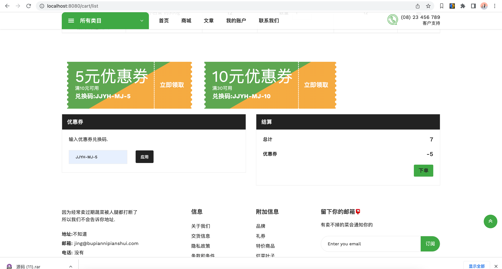
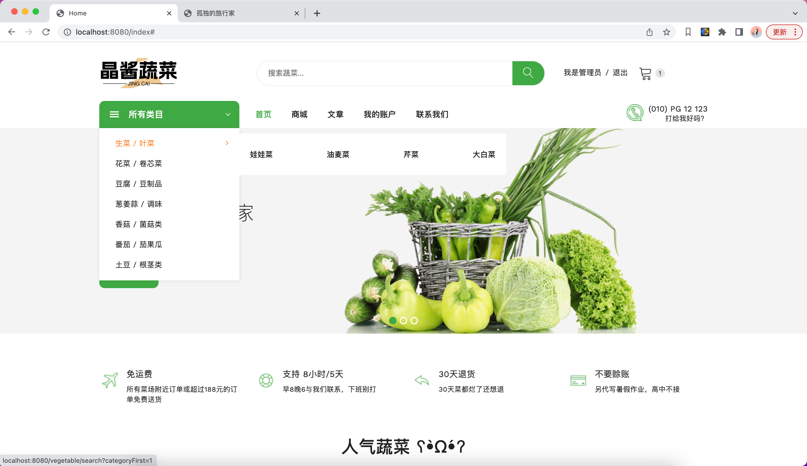
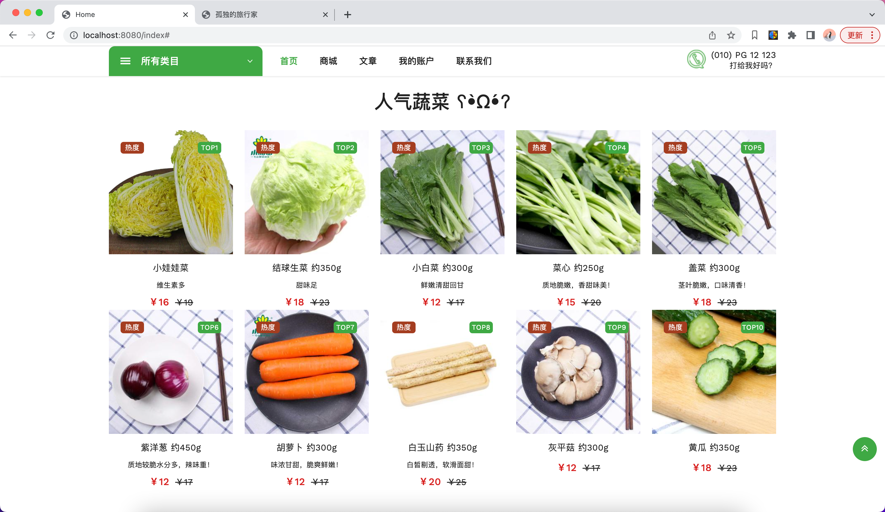
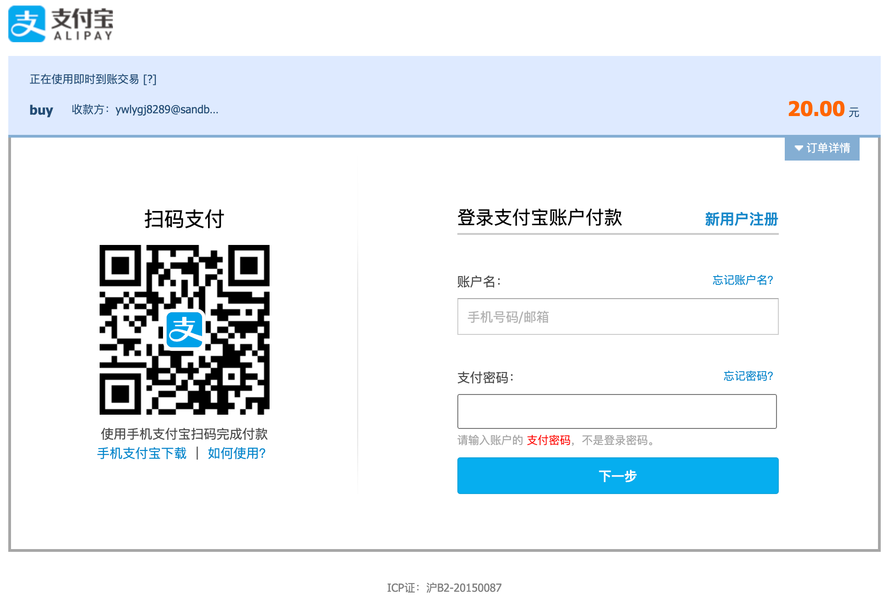
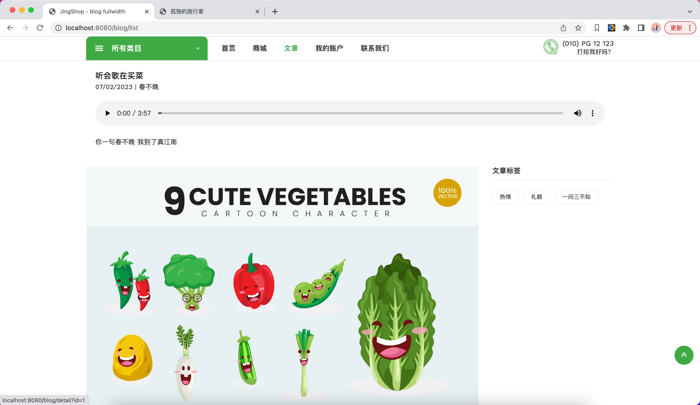
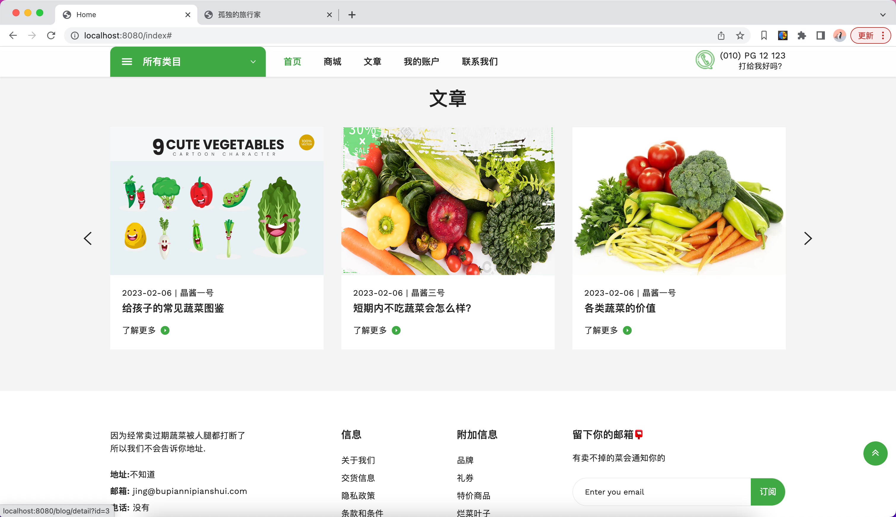
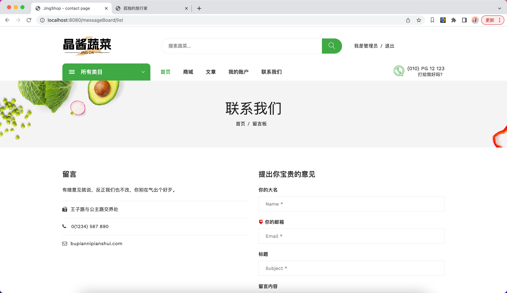

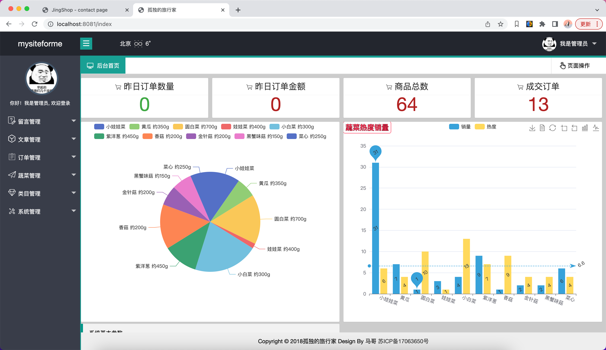
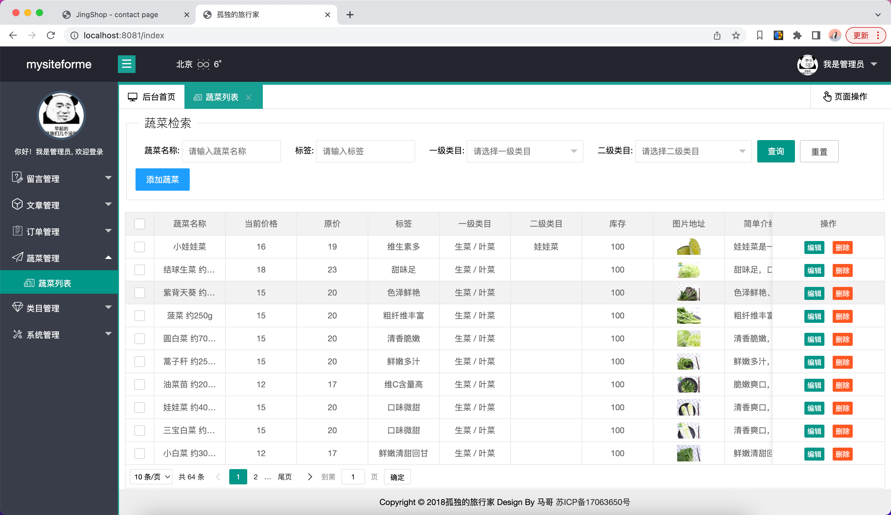
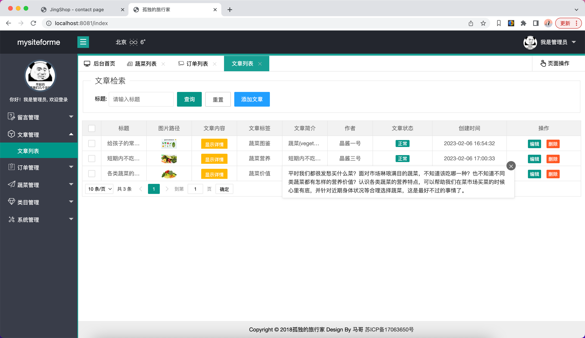
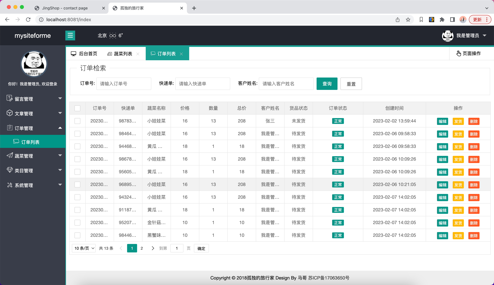
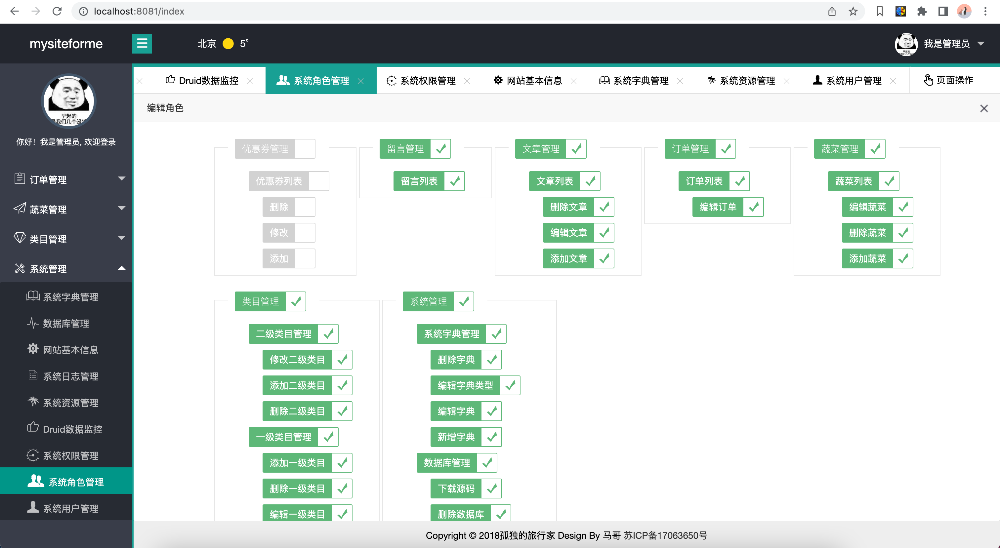

[后台系统用到的开源项目](https://gitee.com/wanglingxiao/mysiteforme)
> 全自动生成代码，搬砖神器，从此把项目经理踩在脚下

天下没有免费的午餐，前后端代码+部署调试搞活动，详情加QQ咨询。
前10名购买半价，另外有一些学习问题也可以一起交流，买到就是赚到！！

QQ：356563069

助理QQ：1942683185
